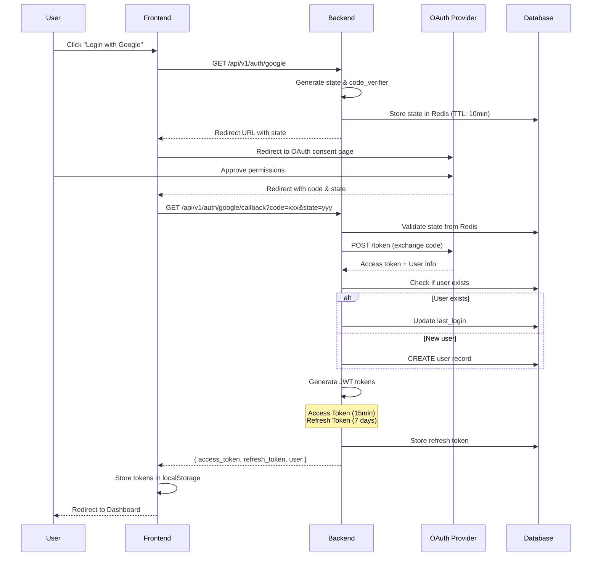
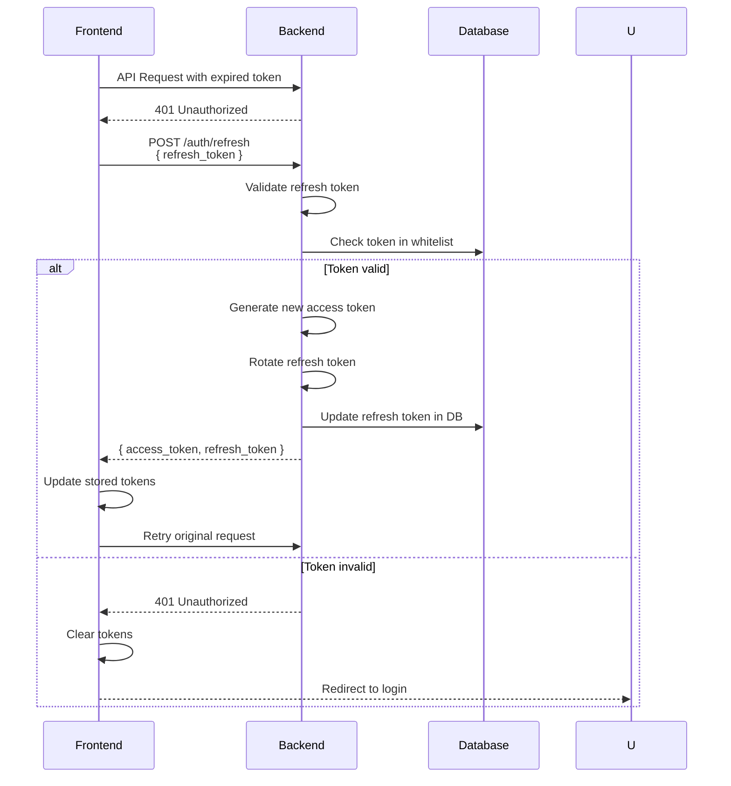
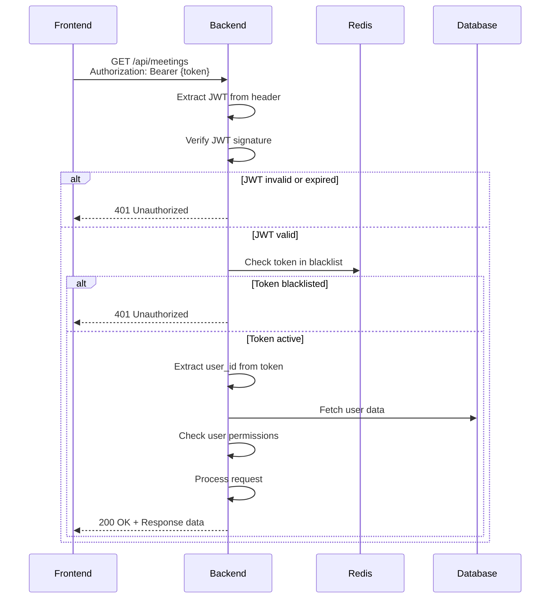
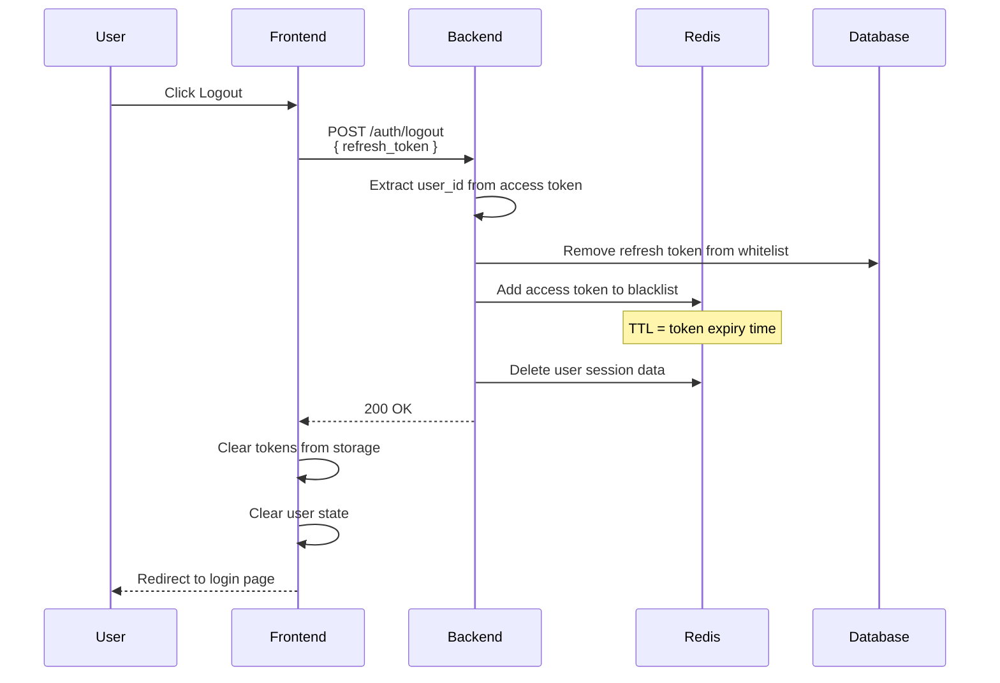
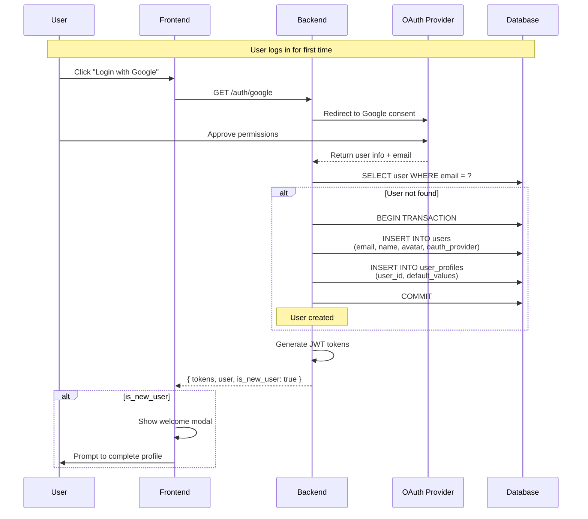

# Authentication Flow

## Overview

Hệ thống sử dụng OAuth2 để xác thực người dùng thông qua Google. JWT tokens được sử dụng để duy trì session. Backend được xây dựng với Echo framework theo Clean Architecture.

## Tech Stack

- **Framework**: Echo v4
- **OAuth Provider**: Google OAuth2 only
- **Token**: JWT (jsonwebtoken)
- **Session Store**: Redis
- **Architecture**: Clean Architecture

## OAuth2 Flow

### User Login Sequence



## JWT Token Structure

### Access Token Payload

```json
{
  "sub": "user_id_123",
  "email": "user@example.com",
  "name": "John Doe",
  "role": "user",
  "iat": 1699000000,
  "exp": 1699000900,
  "type": "access"
}
```

### Refresh Token Payload

```json
{
  "sub": "user_id_123",
  "jti": "unique_token_id",
  "iat": 1699000000,
  "exp": 1699604800,
  "type": "refresh"
}
```

## Token Refresh Flow



## Protected API Request Flow



## Logout Flow



## User Registration Flow (OAuth2)



## Role-Based Access Control (RBAC)

### User Roles

| Role | Description | Permissions |
|------|-------------|-------------|
| `admin` | System administrator | Full access to all resources |
| `host` | Meeting host | Create rooms, manage participants, access all meeting features |
| `participant` | Regular user | Join rooms, view own reports |

### Permission Check Middleware (Echo)

```go
// internal/adapter/handler/middleware/rbac.go
package middleware

import (
    "net/http"
    "github.com/labstack/echo/v4"
)

func RequireRole(allowedRoles ...string) echo.MiddlewareFunc {
    return func(next echo.HandlerFunc) echo.HandlerFunc {
        return func(c echo.Context) error {
            userRole := c.Get("user_role").(string)
            
            for _, role := range allowedRoles {
                if userRole == role {
                    return next(c)
                }
            }
            
            return c.JSON(http.StatusForbidden, map[string]string{
                "error": "Insufficient permissions",
            })
        }
    }
}

// Usage in routes
// internal/infrastructure/http/routes.go
protected.POST("/rooms", createRoom, middleware.RequireRole("host", "admin"))
protected.DELETE("/rooms/:id", deleteRoom, middleware.RequireRole("host", "admin"))
protected.GET("/reports/:id", getReport, middleware.RequireRole("host", "participant"))
```

## API Endpoints

### Authentication Endpoints

```yaml
# OAuth Login (Google only)
GET /api/v1/auth/google
GET /api/v1/auth/google/callback

# Token Management
POST /api/v1/auth/refresh
  Body: { refresh_token: string }
  Response: { access_token: string, refresh_token: string }

POST /api/v1/auth/logout
  Headers: Authorization: Bearer {token}
  Body: { refresh_token: string }
  Response: { message: "Logged out successfully" }

# User Info
GET /api/v1/auth/me
  Headers: Authorization: Bearer {token}
  Response: { user: UserObject }
```

## Security Best Practices

### Token Storage

**Frontend:**
- ✅ Store access token in memory (React state)
- ✅ Store refresh token in httpOnly cookie (preferred) or localStorage
- ❌ Never store sensitive data in localStorage without encryption

**Backend:**
- ✅ Store refresh tokens in database with user association
- ✅ Implement token rotation on refresh
- ✅ Use Redis for token blacklist (logout)

### Token Security

1. **Short-lived Access Tokens**
   - Expiry: 15 minutes
   - Reduces impact of token theft

2. **Long-lived Refresh Tokens**
   - Expiry: 7 days
   - Rotate on each use
   - Store in secure httpOnly cookie

3. **Token Blacklisting**
   - Add to Redis on logout
   - TTL = remaining token lifetime
   - Check on each protected request

### OAuth2 Security

1. **State Parameter**
   - Prevent CSRF attacks
   - Generate random state
   - Validate on callback

2. **PKCE (Proof Key for Code Exchange)**
   - Use code_verifier and code_challenge
   - Additional security for public clients

3. **Scope Limitation**
   - Request minimal OAuth scopes
   - Only: email, profile, openid

## Database Schema

### users table

```sql
CREATE TABLE users (
    id UUID PRIMARY KEY DEFAULT gen_random_uuid(),
    email VARCHAR(255) UNIQUE NOT NULL,
    name VARCHAR(255) NOT NULL,
    avatar_url TEXT,
    oauth_provider VARCHAR(50) DEFAULT 'google', -- Only Google for now
    oauth_id VARCHAR(255),
    role VARCHAR(20) DEFAULT 'participant', -- 'admin', 'host', 'participant'
    is_active BOOLEAN DEFAULT true,
    created_at TIMESTAMP DEFAULT NOW(),
    updated_at TIMESTAMP DEFAULT NOW(),
    last_login_at TIMESTAMP
);

CREATE INDEX idx_users_email ON users(email);
CREATE INDEX idx_users_oauth ON users(oauth_provider, oauth_id);
```

### sessions table

```sql
CREATE TABLE sessions (
    id UUID PRIMARY KEY DEFAULT gen_random_uuid(),
    user_id UUID NOT NULL REFERENCES users(id) ON DELETE CASCADE,
    token_hash VARCHAR(255) NOT NULL,
    expires_at TIMESTAMP NOT NULL,
    created_at TIMESTAMP DEFAULT NOW(),
    revoked_at TIMESTAMP,
    CONSTRAINT fk_user FOREIGN KEY (user_id) REFERENCES users(id)
);

CREATE INDEX idx_sessions_user ON sessions(user_id);
CREATE INDEX idx_sessions_hash ON sessions(token_hash);
```

## Redis Keys Structure

```yaml
# User sessions
session:{user_id} -> { user_data }
TTL: 7 days

# OAuth states (CSRF protection)
oauth:state:{state} -> { user_id, timestamp }
TTL: 10 minutes

# Token blacklist (logout)
blacklist:token:{jti} -> { user_id }
TTL: token expiry time

# Rate limiting
ratelimit:login:{ip} -> count
TTL: 1 hour
```

## Error Handling

### Error Codes

| Code | Description | Action |
|------|-------------|--------|
| `AUTH_INVALID_TOKEN` | JWT is invalid or expired | Request token refresh |
| `AUTH_TOKEN_EXPIRED` | Access token expired | Use refresh token |
| `AUTH_REFRESH_FAILED` | Refresh token invalid | Redirect to login |
| `AUTH_INSUFFICIENT_PERMISSIONS` | User lacks required role | Show error message |
| `AUTH_USER_DISABLED` | Account deactivated | Contact support |

### Error Response Format

```json
{
  "error": {
    "code": "AUTH_INVALID_TOKEN",
    "message": "The provided token is invalid or expired",
    "details": "Token signature verification failed",
    "timestamp": "2025-11-03T10:30:00Z"
  }
}
```

## Testing Scenarios

### Unit Tests

- ✅ JWT generation and validation
- ✅ Token expiry handling
- ✅ OAuth callback processing
- ✅ Password hashing (if applicable)
- ✅ Permission checking

### Integration Tests

- ✅ Complete OAuth flow
- ✅ Token refresh flow
- ✅ Logout and token revocation
- ✅ Protected endpoint access
- ✅ Role-based access control

### Security Tests

- ✅ CSRF attack prevention
- ✅ Token reuse after logout
- ✅ Expired token rejection
- ✅ Invalid signature detection
- ✅ Privilege escalation attempts

## Monitoring

### Metrics to Track

- Login success/failure rate
- Token refresh rate
- Average token lifetime
- Failed authentication attempts
- OAuth provider response time

### Alerts

- High rate of failed logins (potential attack)
- OAuth provider downtime
- Token validation errors spike
- Unusual token refresh patterns

## Future Enhancements

- [ ] Multi-factor authentication (MFA)
- [ ] Biometric authentication (WebAuthn)
- [ ] Session management dashboard
- [ ] Suspicious activity detection
- [ ] Device fingerprinting
- [ ] Advanced rate limiting per user
