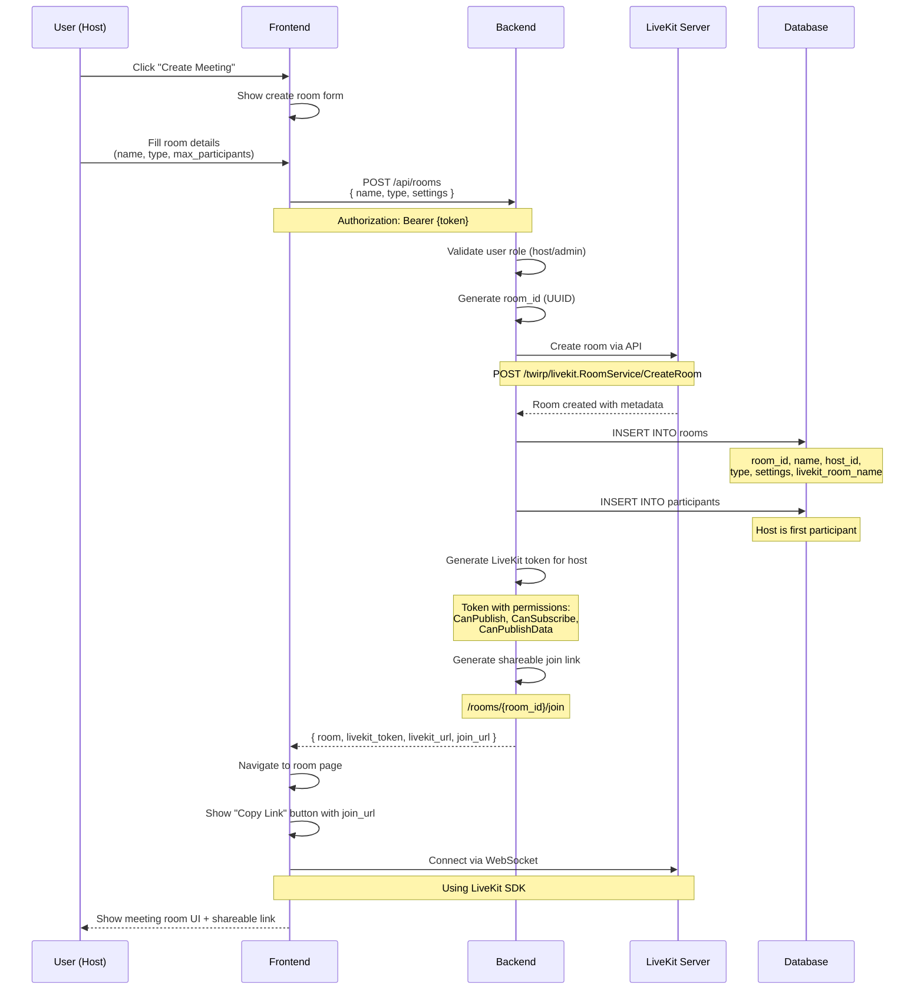
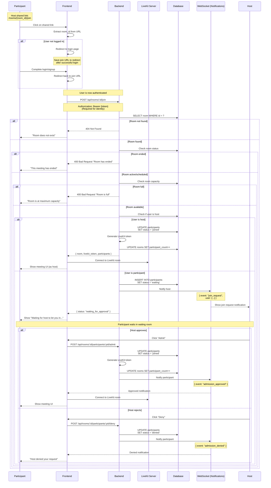
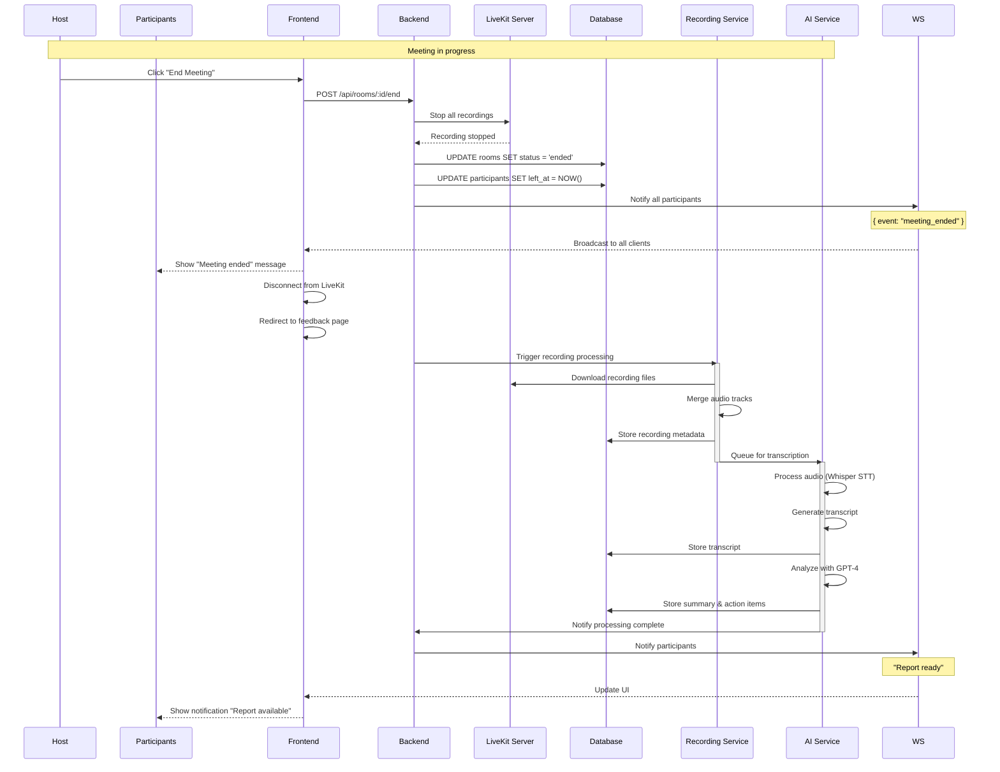
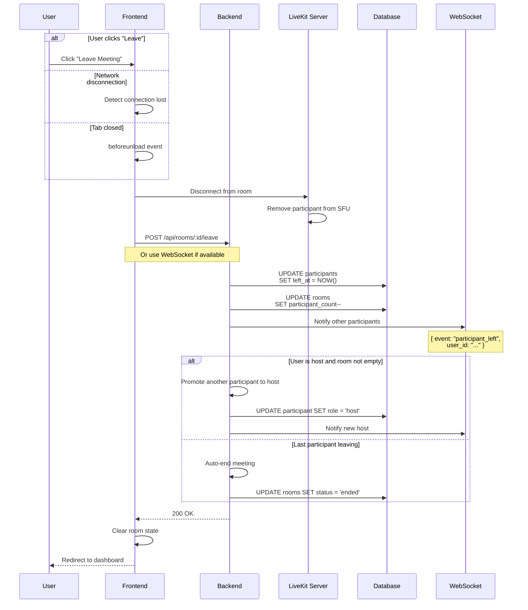
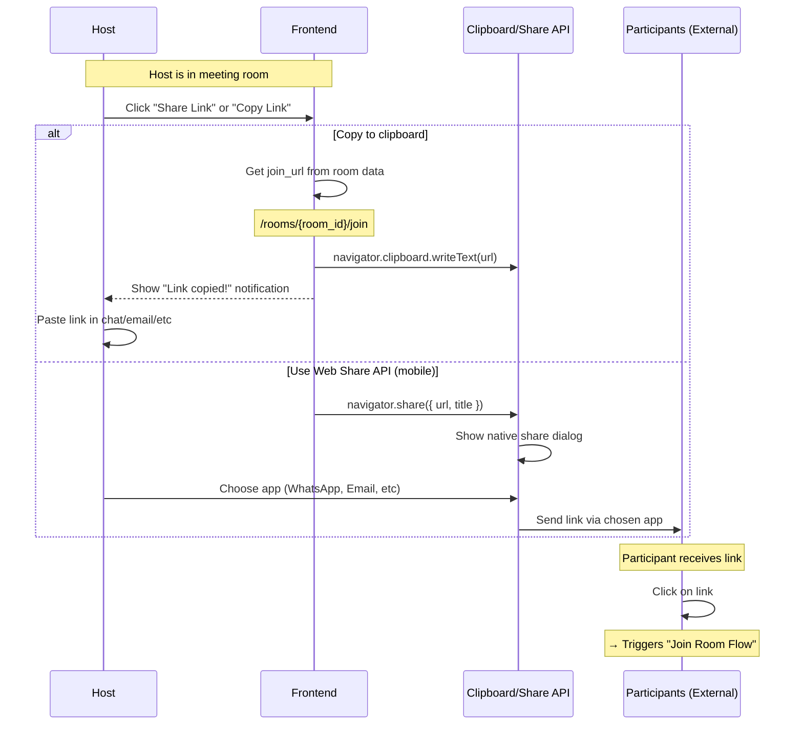
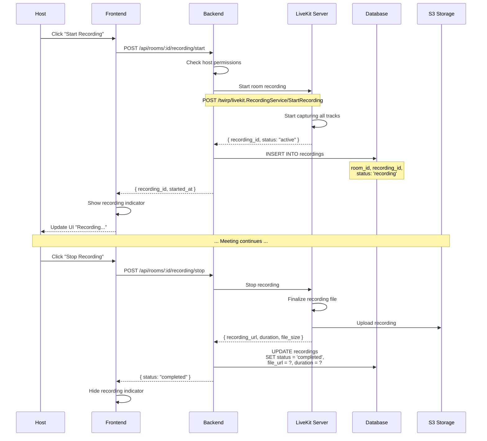
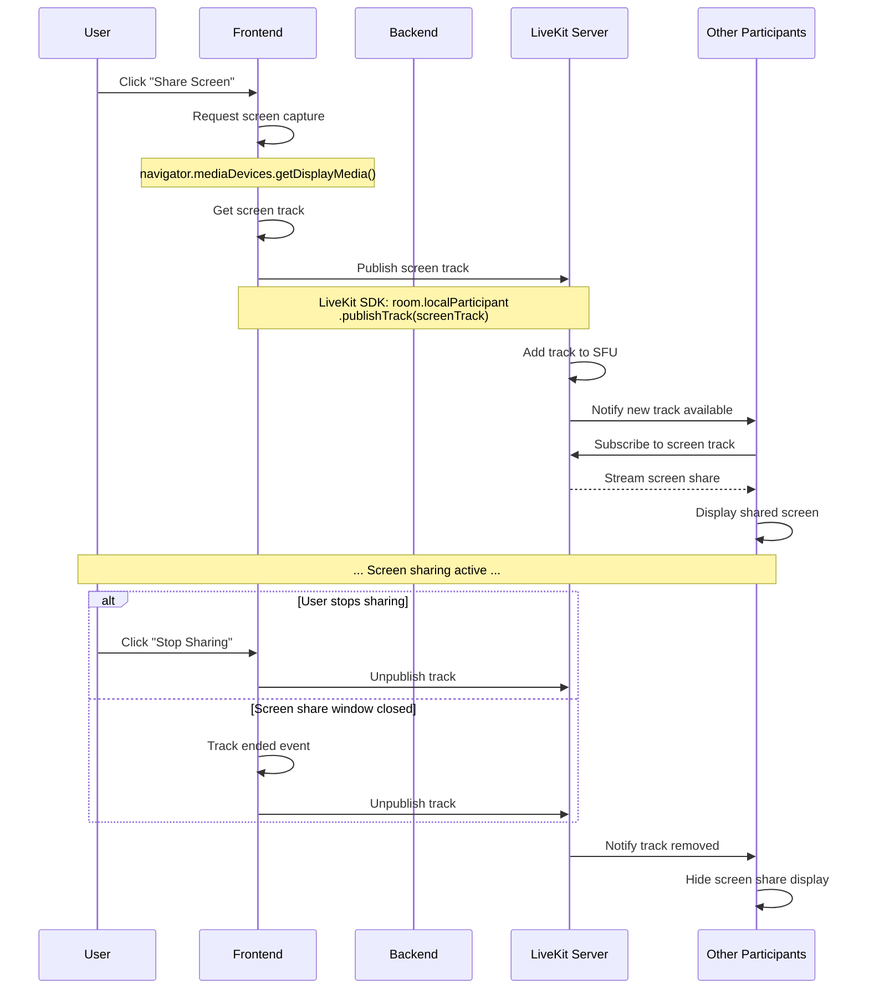
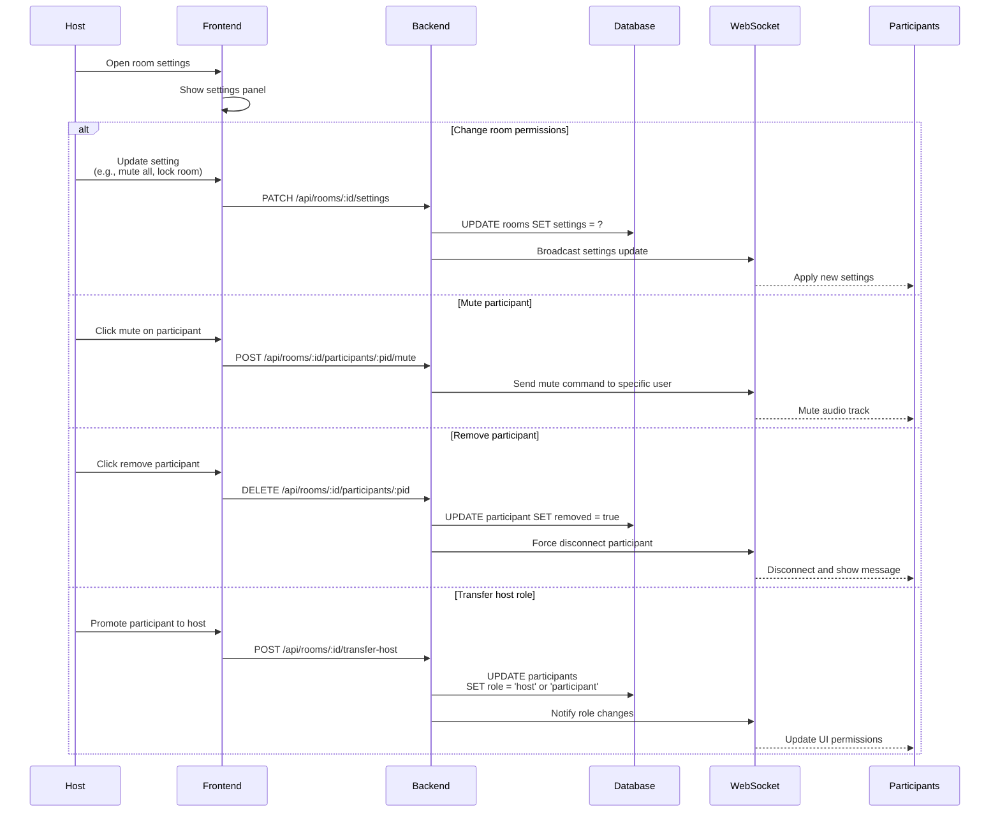

# Room Management & Meeting Flow

## Overview

Hệ thống quản lý phòng họp cho phép người dùng tạo, tham gia và quản lý các cuộc họp trực tuyến với audio/video real-time thông qua LiveKit.

## Room Access Control

### Join Flow
- **Tất cả participants đều phải được host approve**
- Click link → Login → Waiting room
- Host nhận notification → Approve/Deny
- Không có auto-admit, host kiểm soát hoàn toàn

### Exception: Host
- Host là người tạo room → tự động join ngay
- Không cần approval cho chính host

## Create Room Flow



## Join Room Flow (Via Shared Link)



## Complete Meeting Flow



## Leave Room Flow



## Share Room Link Flow



## Recording Control Flow



## Screen Share Flow



## Room Settings Management



## API Endpoints

### Room Management

```yaml
# Create Room
POST /api/rooms
  Headers: Authorization: Bearer {token}
  Body:
    name: string (required)
    description: string
    max_participants: number (default: 10)
    settings:
      enable_recording: boolean
      enable_chat: boolean
  Response:
    room: RoomObject
    livekit_token: string
    livekit_url: string
    join_url: string

# Get Room Details
GET /api/rooms/:id
  Response:
    room: RoomObject
    participants: ParticipantObject[]

# List Rooms
GET /api/rooms
  Query:
    type: "public" | "private" | "all"
    status: "active" | "ended" | "scheduled"
    limit: number
    offset: number
  Response:
    rooms: RoomObject[]
    total: number

# Update Room
PATCH /api/rooms/:id
  Body: Partial<RoomObject>
  Response: RoomObject

# Delete Room
DELETE /api/rooms/:id
  Response: { message: "Room deleted" }

# End Meeting
POST /api/rooms/:id/end
  Response: { message: "Meeting ended" }

# Join Room (via shared link)
POST /api/rooms/:id/join
  Headers: Authorization: Bearer {token}
  Response (if host):
    room: RoomObject
    livekit_token: string
    livekit_url: string
    participants: ParticipantObject[]
    participant: ParticipantObject (current user)
  Response (if participant - waiting):
    status: "waiting_for_approval"
    message: "Waiting for host to let you in"
    participant: ParticipantObject (status: 'waiting')

# Admit Participant (Host only)
POST /api/rooms/:id/participants/:pid/admit
  Response: { message: "Participant admitted" }

# Deny Participant (Host only)  
POST /api/rooms/:id/participants/:pid/deny
  Body: { reason: string }
  Response: { message: "Participant denied" }

# Get Waiting Participants (Host only)
GET /api/rooms/:id/participants/waiting
  Response:
    participants: ParticipantObject[] (status: 'waiting')

# Leave Room
POST /api/rooms/:id/leave
  Response: { message: "Left room" }
```

### Recording Management

```yaml
# Start Recording
POST /api/rooms/:id/recording/start
  Response:
    recording_id: string
    started_at: timestamp

# Stop Recording
POST /api/rooms/:id/recording/stop
  Response:
    recording_id: string
    status: "completed"
    duration: number
    file_url: string

# List Recordings
GET /api/rooms/:id/recordings
  Response:
    recordings: RecordingObject[]
```

### Participant Management

```yaml
# List Participants
GET /api/rooms/:id/participants
  Response:
    participants: ParticipantObject[]

# Mute Participant
POST /api/rooms/:id/participants/:pid/mute
  Response: { status: "muted" }

# Unmute Participant
POST /api/rooms/:id/participants/:pid/unmute
  Response: { status: "unmuted" }

# Remove Participant
DELETE /api/rooms/:id/participants/:pid
  Response: { message: "Participant removed" }

# Transfer Host
POST /api/rooms/:id/transfer-host
  Body: { new_host_id: string }
  Response: { message: "Host transferred" }
```

## Database Schema

### rooms table

```sql
CREATE TABLE rooms (
    id UUID PRIMARY KEY DEFAULT gen_random_uuid(),
    name VARCHAR(255) NOT NULL,
    description TEXT,
    host_id UUID NOT NULL REFERENCES users(id),
    status VARCHAR(20) NOT NULL DEFAULT 'active', -- 'scheduled', 'active', 'ended'
    livekit_room_name VARCHAR(255) UNIQUE NOT NULL,
    max_participants INT DEFAULT 10,
    current_participants INT DEFAULT 0,
    settings JSONB DEFAULT '{}',
    started_at TIMESTAMP,
    ended_at TIMESTAMP,
    created_at TIMESTAMP DEFAULT NOW(),
    updated_at TIMESTAMP DEFAULT NOW()
);

CREATE INDEX idx_rooms_host ON rooms(host_id);
CREATE INDEX idx_rooms_status ON rooms(status);
```

### participants table

```sql
CREATE TABLE participants (
    id UUID PRIMARY KEY DEFAULT gen_random_uuid(),
    room_id UUID NOT NULL REFERENCES rooms(id) ON DELETE CASCADE,
    user_id UUID NOT NULL REFERENCES users(id),
    role VARCHAR(20) DEFAULT 'participant', -- 'host', 'participant'
    status VARCHAR(20) DEFAULT 'waiting', -- 'waiting', 'joined', 'left', 'denied'
    joined_at TIMESTAMP,
    left_at TIMESTAMP,
    is_removed BOOLEAN DEFAULT false,
    metadata JSONB DEFAULT '{}',
    created_at TIMESTAMP DEFAULT NOW(),
    CONSTRAINT unique_room_user UNIQUE (room_id, user_id)
);

CREATE INDEX idx_participants_room ON participants(room_id);
CREATE INDEX idx_participants_user ON participants(user_id);
CREATE INDEX idx_participants_status ON participants(status);
```

### recordings table

```sql
CREATE TABLE recordings (
    id UUID PRIMARY KEY DEFAULT gen_random_uuid(),
    room_id UUID NOT NULL REFERENCES rooms(id) ON DELETE CASCADE,
    livekit_recording_id VARCHAR(255) UNIQUE,
    status VARCHAR(20) NOT NULL, -- 'recording', 'processing', 'completed', 'failed'
    file_url TEXT,
    file_size BIGINT,
    duration INT, -- seconds
    format VARCHAR(20), -- 'mp4', 'webm', 'mp3'
    started_at TIMESTAMP NOT NULL,
    completed_at TIMESTAMP,
    created_at TIMESTAMP DEFAULT NOW()
);

CREATE INDEX idx_recordings_room ON recordings(room_id);
CREATE INDEX idx_recordings_status ON recordings(status);
```

### ~~room_invitations table~~ (REMOVED - Not needed with link sharing)

**Note:** With the new link-sharing approach, we don't need a separate invitations table. 
Anyone with the link can join (if room not full and not ended).

## LiveKit Integration

### Room Configuration

```go
// Create LiveKit room
func createLiveKitRoom(roomID string, settings RoomSettings) (*livekit.Room, error) {
    client := lksdk.NewRoomServiceClient(LIVEKIT_URL, LIVEKIT_API_KEY, LIVEKIT_API_SECRET)
    
    room, err := client.CreateRoom(context.Background(), &livekit.CreateRoomRequest{
        Name: roomID,
        EmptyTimeout: 60 * 10, // 10 minutes
        MaxParticipants: settings.MaxParticipants,
    })
    
    return room, err
}
```

### Generate Access Token

```go
func generateLiveKitToken(roomName, participantName, userID string, isHost bool) (string, error) {
    at := auth.NewAccessToken(LIVEKIT_API_KEY, LIVEKIT_API_SECRET)
    
    grant := &auth.VideoGrant{
        RoomJoin: true,
        Room:     roomName,
        CanPublish: true,
        CanSubscribe: true,
    }
    
    if isHost {
        grant.RoomAdmin = true
        grant.RoomRecord = true
    }
    
    at.AddGrant(grant).
        SetIdentity(userID).
        SetName(participantName).
        SetValidFor(2 * time.Hour)
    
    return at.ToJWT()
}
```

### WebHook Handling

```go
// Handle LiveKit webhooks
func handleLiveKitWebhook(w http.ResponseWriter, r *http.Request) {
    event := &livekit.WebhookEvent{}
    
    // Verify webhook signature
    if !verifyWebhook(r) {
        http.Error(w, "Invalid signature", http.StatusUnauthorized)
        return
    }
    
    // Parse event
    json.NewDecoder(r.Body).Decode(event)
    
    switch event.Event {
    case "participant_joined":
        handleParticipantJoined(event)
    case "participant_left":
        handleParticipantLeft(event)
    case "recording_finished":
        handleRecordingFinished(event)
    case "room_finished":
        handleRoomFinished(event)
    }
}
```

## WebSocket Events

### Server → Client Events

```typescript
// Participant joined
{
  type: "participant_joined",
  data: {
    user_id: string,
    name: string,
    avatar: string,
    role: "host" | "participant"
  }
}

// Join request (waiting room)
{
  type: "join_request",
  data: {
    user_id: string,
    name: string,
    avatar: string,
    participant_id: string
  }
}

// Admission approved
{
  type: "admission_approved",
  data: {
    participant_id: string,
    livekit_token: string
  }
}

// Admission denied
{
  type: "admission_denied",
  data: {
    participant_id: string,
    reason: string
  }
}

// Participant left
{
  type: "participant_left",
  data: {
    user_id: string,
    reason: "left" | "removed" | "disconnected"
  }
}

// Meeting ended
{
  type: "meeting_ended",
  data: {
    room_id: string,
    ended_by: string,
    duration: number
  }
}

// Recording status changed
{
  type: "recording_status",
  data: {
    recording_id: string,
    status: "started" | "stopped" | "completed"
  }
}

// Settings updated
{
  type: "settings_updated",
  data: {
    settings: RoomSettings
  }
}

// Host transferred
{
  type: "host_transferred",
  data: {
    new_host_id: string,
    new_host_name: string
  }
}
```

## Error Handling

### Common Errors

| Error Code | Description | Resolution |
|------------|-------------|------------|
| `ROOM_NOT_FOUND` | Room doesn't exist | Verify room ID |
| `ROOM_FULL` | Max participants reached | Wait or create new room |
| `ROOM_ENDED` | Meeting already ended | Cannot rejoin |
| `ACCESS_DENIED` | Not invited/authorized | Request invitation |
| `INVALID_TOKEN` | LiveKit token expired | Request new token |
| `RECORDING_FAILED` | Recording error | Check LiveKit logs |
| `HOST_REQUIRED` | Operation requires host role | Contact host |

## Security Considerations

### Room Access Control
- ✅ **Require authentication** - Must be logged in to join any room
- ✅ **Identify users** - Track who joined via JWT token user_id
- ✅ **Host approval required** - All participants must be approved by host
- ✅ **Waiting room** - Participants wait for host approval (except host)
- ✅ **Host auto-join** - Host (creator) joins immediately without approval
- ✅ Check room status (not ended) before allowing join
- ✅ Rate limit room creation per user
- ✅ Validate max participants limit

### LiveKit Security
- ✅ Short-lived access tokens (2 hours)
- ✅ Token includes user identity
- ✅ Webhook signature verification
- ✅ Secure API key storage

### Data Privacy
- ✅ Encrypt recordings at rest
- ✅ Auto-delete old recordings (30 days)
- ✅ User consent for recording
- ✅ GDPR-compliant data handling

## Testing Scenarios

- [ ] **Host creates room** → gets join link
- [ ] **Host joins own room** → auto-admitted (no waiting)
- [ ] **Participant joins via link** → enters waiting room
- [ ] **Host receives notification** → when someone requests to join
- [ ] **Host admits participant** → participant joins meeting
- [ ] **Host denies participant** → participant gets rejection message
- [ ] **Waiting room UI** → show list of waiting participants to host
- [ ] **Participant waiting UI** → show "Waiting for host..." message
- [ ] **Multiple waiting** → multiple participants in waiting room
- [ ] **Room full** → new joins rejected with error (after admission)
- [ ] **Room ended** → cannot join via link
- [ ] **Host can end meeting** → all participants disconnected
- [ ] **Participant can leave meeting** → removed from participant list
- [ ] **Copy link functionality** → test clipboard API
- [ ] **Mobile share** → test Web Share API on mobile devices
