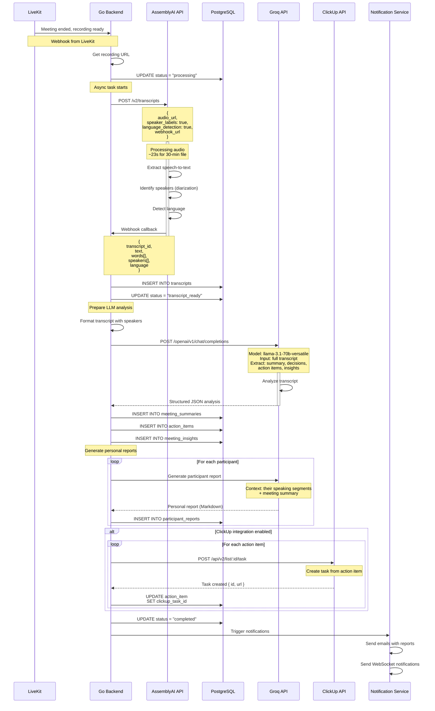
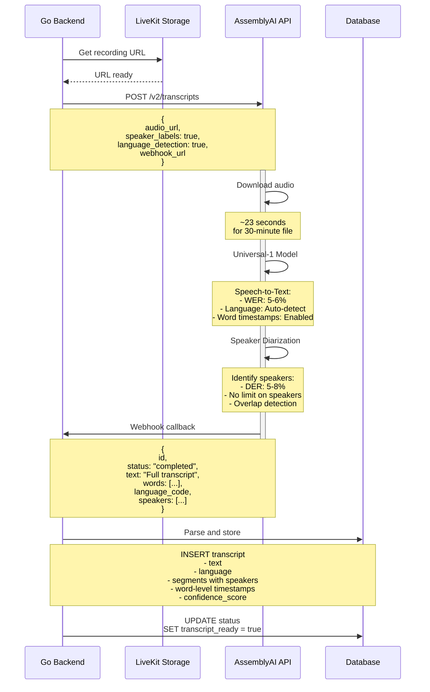
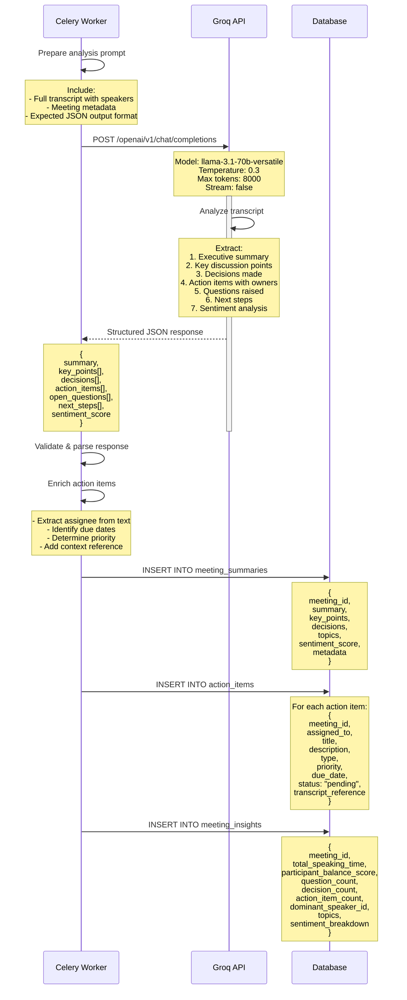
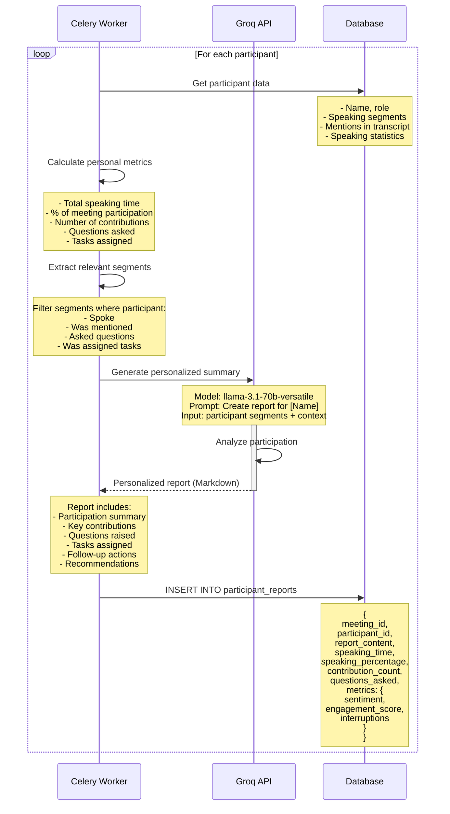
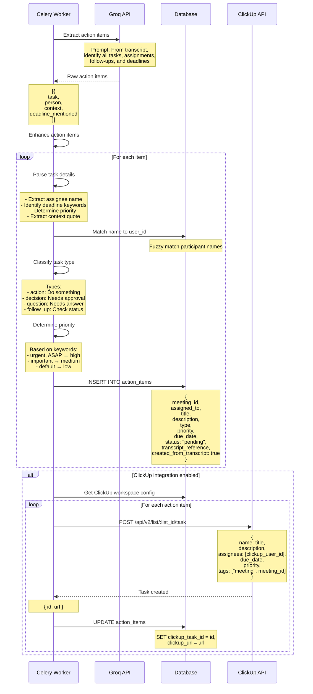
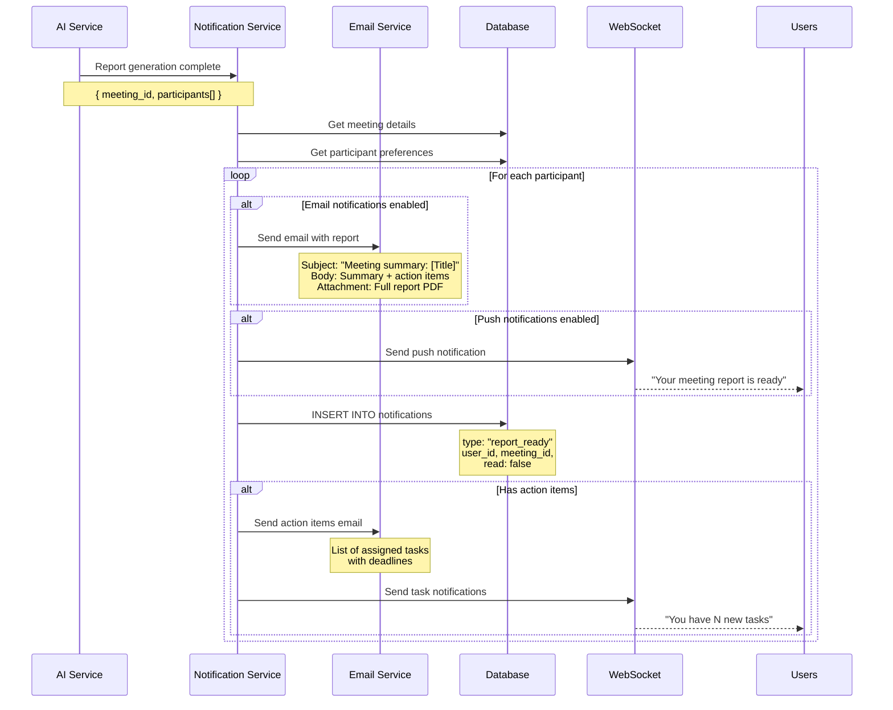

# AI Meeting Analysis Flow

## Overview

Hệ thống AI tự động xử lý ghi âm cuộc họp, chuyển đổi thành văn bản (transcript), phân tích nội dung và tạo báo cáo với action items cho từng người tham gia.

**🎯 Giải pháp Phase 1: API-Only Stack (Minimal Infrastructure)**

## Architecture Decision

**✅ Kiến trúc đơn giản:** Chỉ cần Go Backend + External APIs:

- **Go Backend**: Meeting management, authentication, API endpoints, webhook receivers
- **AssemblyAI API**: Speech-to-text + speaker diarization (built-in)
- **Groq API**: LLM analysis (summary, action items, insights)
- **Communication**: Direct API calls, no queues, no extra services

**Lợi ích:**
- ✅ Zero infrastructure needed (no server 24/7)
- ✅ Minimal dependencies (Go only)
- ✅ Fast deployment and scaling
- ✅ Automatic speaker diarization (AssemblyAI built-in)
- ✅ Low cost (~$10-15/month for 100 meetings)

## Technology Stack

### Speech-to-Text + Speaker Diarization
- **Service**: AssemblyAI API (Universal Model)
- **Cost**: FREE $50 credit (185 hours/month free)
- **WER (Word Error Rate)**: ~5-6% (comparable to Whisper large-v3)
- **Performance**: 
  - 30-minute audio: **23 seconds** ⚡
  - 60-minute audio: ~45 seconds
  - No file size or duration limits
- **Built-in Features**:
  - ✅ Speaker diarization (DER: 5-8%)
  - ✅ Language detection (99+ languages)
  - ✅ Word-level timestamps
  - ✅ Confidence scores
- **Limitations**: 
  - ⚠️ No fine-tuning (API-only)
  - ⚠️ $0.15/hour after free tier

### Text Analysis (LLM)
- **Service**: Groq API (FREE tier)
  - Model: Llama 3.1 70B Versatile
  - Free: 500 requests/day (~15-20 meetings/day)
  - Speed: 750+ tokens/sec (18x faster than GPT-4)
  - Quality: Comparable to GPT-4 for summarization
- **Cost**: FREE up to 500 requests/day
- **Alternative (Phase 2)**: Self-hosted Llama 3.1 8B
  - Cost: $0 (only infrastructure)
  - Requirements: 8GB RAM/VRAM

## AI Processing Pipeline

```
Recording (LiveKit) → Go Backend
                           ↓
                    Meeting ended webhook
                           ↓
            ┌──────────────┴──────────────┐
            ↓                             ↓
    Download Audio                Update Status
    from LiveKit                  to DB
            ↓
    ┌───────────────────────────────────┐
    │   AssemblyAI API                  │
    │   - Speech-to-Text                │
    │   - Speaker Diarization (built-in)│
    │   Duration: ~23s for 30-min audio │
    └───────────────────┬───────────────┘
                        ↓
            ┌───────────────────────────┐
            │   Insert Transcript       │
            │   + Speaker Labels        │
            └───────────┬───────────────┘
                        ↓
            ┌───────────────────────────┐
            │   Groq API (Llama 3.1)    │
            │   - Summary               │
            │   - Key Points            │
            │   - Decisions             │
            │   - Action Items          │
            └───────────┬───────────────┘
                        ↓
            ┌───────────────────────────┐
            │   Generate Reports        │
            │   for each participant    │
            └───────────┬───────────────┘
                        ↓
            ┌─────────────────────────────────────┐
            │   Insert Analysis Results to DB     │
            │   - summaries                       │
            │   - action_items                    │
            │   - participant_reports             │
            └─────────────┬───────────────────────┘
                          ↓
                  Notify Participants
                  (Email + WebSocket)
```

## Complete AI Flow (API-Only Architecture)



## Speech-to-Text + Speaker Diarization (AssemblyAI)

### Process Flow



### AssemblyAI Features

**Accuracy & Speed:**

| Metric | Value |
|--------|-------|
| **WER (Word Error Rate)** | ~5-6% |
| **Language Support** | 99+ languages |
| **Processing Speed** | 23s for 30-min audio |
| **Speaker Diarization (DER)** | 5-8% (2-3 speakers: 90%+ accuracy) |
| **File Size Limit** | ✅ NONE |
| **Duration Limit** | ✅ NONE |

**Built-in Features:**

```yaml
Features:
  - Speech-to-Text
    - Universal model (optimized for business audio)
    - 99+ languages support
    - Auto language detection
    - Word-level timestamps and confidence
    - Punctuation and capitalization
    
  - Speaker Diarization
    - Identify and label speakers
    - DER (Diarization Error Rate): 5-8%
    - Works without participant list
    - Handles overlapping speech
    - Supports 2-10+ speakers
    
  - Audio Quality
    - Automatic noise filtering
    - Handles poor quality recordings
    - Supports MP3, WAV, FLAC, M4A, etc.
    - No preprocessing needed
    
  - Additional
    - Language detection
    - Entity recognition (names, numbers)
    - Paragraph and sentence segmentation
```

**Cost Breakdown (for 100 meetings/month, 30 min each):**

| Usage | Free Tier | Paid Tier | Cost |
|-------|-----------|-----------|------|
| **Pre-recorded audio** | 185 hours/month | $0.15/hour | $0.00 (fits free tier) |
| **Speaker ID add-on** | Included | $0.02/hour | $0.00 (included) |
| **Total/month** | ~370 meetings | N/A | $0.00 |

**Comparison with Alternatives:**

| Aspect | AssemblyAI | Whisper API | Whisper Self-hosted |
|--------|------------|------------|-------------------|
| **Speed** | ⚡⚡⚡ 23s/30min | ⚡⚡ Slow | ⚠️ 9 min (CPU) |
| **Accuracy** | ⭐⭐⭐⭐⭐ | ⭐⭐⭐⭐⭐ | ⭐⭐⭐⭐⭐ |
| **Diarization** | ✅ Built-in | ❌ Separate | ❌ Separate |
| **Setup** | ✅ None | ⚠️ API key | ❌ Server + code |
| **Cost** | FREE 185h/mo | $0.006/min | FREE (infra cost) |
| **Infrastructure** | None | None | 24/7 server needed |

## LLM Analysis Process (Groq API - FREE)



**Groq API Details:**

| Feature | Details |
|---------|---------|
| **Model** | Llama 3.1 70B Versatile |
| **Free Tier** | 500 requests/day (~15-20 meetings/day) |
| **Speed** | 750+ tokens/sec (18x faster than GPT-4) |
| **Quality** | Comparable to GPT-4 for summarization |
| **Max Tokens** | 8192 output tokens |
| **Cost (if exceed)** | $0.00027/1K input, $0.00027/1K output |

**Example Cost Comparison (100 meetings/month, 30 min each):**

| Service | Cost/Meeting | Total/Month |
|---------|--------------|-------------|
| GPT-4 Turbo | $0.14 | $14.00 |
| GPT-3.5 Turbo | $0.005 | $0.50 |
| **Groq (Free)** | **$0.00** | **$0.00** |
| Groq (Paid) | $0.003 | $0.30 |

**Alternative: Self-Hosted Llama 3.1 8B**
- Cost: $0 (only server)
- Requirements: 8GB RAM/VRAM
- Speed: Slower than Groq but still good
- Quality: Slightly lower than 70B but sufficient

## Personal Report Generation



## Action Items Extraction



**Action Item Detection Keywords:**

| Type | Keywords |
|------|----------|
| **Action** | "will do", "I'll", "need to", "should", "must", "have to" |
| **Decision** | "decide", "choose", "approve", "confirm", "agree" |
| **Question** | "who will", "when", "how", "what about", "?" |
| **Follow-up** | "check", "follow up", "review", "update", "report back" |

**Priority Detection:**

| Priority | Keywords |
|----------|----------|
| **Urgent** | "urgent", "ASAP", "immediately", "critical", "emergency" |
| **High** | "important", "priority", "soon", "this week" |
| **Medium** | "should", "need to", "next week" |
| **Low** | "when possible", "eventually", "nice to have" |

## Notification Flow



## API Endpoints

### Go Backend API

```yaml
# Trigger AI Processing
POST /api/meetings/:id/process-ai
  Headers:
    Authorization: Bearer {token}
  Response: 201 Created
    {
      "job_id": "uuid",
      "status": "queued",
      "message": "AI processing started"
    }

# Get Processing Status
GET /api/meetings/:id/ai-status
  Response: 200 OK
    {
      "job_id": "uuid",
      "status": "processing",  # queued, processing, completed, failed
      "progress": {
        "current_step": "diarization",
        "percent": 60
      },
      "started_at": "2024-...",
      "estimated_completion": "2024-..."
    }

# Get Transcript
GET /api/meetings/:id/transcript
  Response: 200 OK
    {
      "transcript_id": "uuid",
      "text": "Full transcript text...",
      "language": "en",
      "segments": [
        {
          "start": 0.0,
          "end": 5.2,
          "text": "Hello everyone",
          "speaker": "John Doe",
          "confidence": 0.95
        }
      ],
      "processing_time": 180  # seconds
    }

# Get Meeting Summary
GET /api/meetings/:id/summary
  Response: 200 OK
    {
      "summary": "Executive summary text...",
      "key_points": ["Point 1", "Point 2"],
      "decisions": [
        {
          "decision": "Decision text",
          "made_by": "John Doe",
          "context": "Discussion context"
        }
      ],
      "topics": ["topic1", "topic2"],
      "sentiment": 0.75,
      "duration": 1800
    }

# Get Action Items
GET /api/meetings/:id/action-items
  Query Parameters:
    assigned_to: user_id (optional)
    status: pending|in_progress|completed (optional)
    priority: low|medium|high|urgent (optional)
  Response: 200 OK
    {
      "action_items": [
        {
          "id": "uuid",
          "title": "Task title",
          "description": "Full description",
          "assigned_to": {
            "id": "uuid",
            "name": "John Doe"
          },
          "type": "action",
          "priority": "high",
          "status": "pending",
          "due_date": "2024-01-15",
          "transcript_reference": "Quote from transcript",
          "clickup_task_id": "abc123",
          "clickup_url": "https://app.clickup.com/...",
          "created_at": "2024-..."
        }
      ]
    }

# Get Personal Report
GET /api/meetings/:id/my-report
  Headers:
    Authorization: Bearer {token}
  Response: 200 OK
    {
      "report_content": "# Your Meeting Report\n\n...",  # Markdown
      "metrics": {
        "speaking_time": 450,  # seconds
        "speaking_percentage": 25.5,
        "contribution_count": 12,
        "questions_asked": 3,
        "sentiment": 0.8,
        "engagement_score": 0.85
      },
      "action_items": [...]  # Your assigned tasks
    }

# Update Action Item
PATCH /api/action-items/:id
  Body:
    {
      "status": "in_progress",  # pending, in_progress, completed, cancelled
      "notes": "Working on this now",
      "completed_at": "2024-..."  # if status = completed
    }
  Response: 200 OK
    {
      "action_item": {...}  # Updated item
    }

# Regenerate AI Analysis
POST /api/meetings/:id/regenerate-ai
  Body:
    {
      "include_diarization": true,
      "language": "auto",  # or specific language code
      "model_size": "medium"  # tiny, base, small, medium, large
    }
  Response: 201 Created
    {
      "job_id": "uuid",
      "status": "queued"
    }

# Export Report
GET /api/meetings/:id/export
  Query Parameters:
    format: pdf|docx|txt|json
    include: summary,transcript,reports,action_items (comma-separated)
  Response: File download
    Content-Type: application/pdf (or appropriate type)
    Content-Disposition: attachment; filename="meeting-report.pdf"
```

## Error Handling

### Common API Errors

```typescript
interface ProcessingError {
  code: string;
  message: string;
  recovery_action: string;
  retry_count?: number;
  max_retries?: number;
}

const errors = {
  // AssemblyAI Errors
  INVALID_AUDIO_URL: {
    code: "INVALID_AUDIO_URL",
    message: "Recording URL is invalid or inaccessible",
    recovery_action: "Verify LiveKit storage is accessible, check URL format",
    max_retries: 2
  },
  AUDIO_TOO_SHORT: {
    code: "AUDIO_TOO_SHORT",
    message: "Audio duration is less than 100ms",
    recovery_action: "Verify recording was captured correctly",
    max_retries: 0
  },
  AUDIO_CORRUPTED: {
    code: "AUDIO_CORRUPTED",
    message: "Audio file is corrupted or not decodable",
    recovery_action: "Re-download recording from LiveKit, verify file integrity",
    max_retries: 1
  },
  ASSEMBLYAI_RATE_LIMIT: {
    code: "ASSEMBLYAI_RATE_LIMIT",
    message: "AssemblyAI API rate limit exceeded",
    recovery_action: "Retry after delay (exponential backoff)",
    max_retries: 5
  },
  ASSEMBLYAI_QUOTA_EXCEEDED: {
    code: "ASSEMBLYAI_QUOTA_EXCEEDED",
    message: "Monthly free quota exceeded (185 hours)",
    recovery_action: "Upgrade to paid tier or trim audio before upload",
    max_retries: 0
  },
  
  // Groq Errors
  LLM_API_ERROR: {
    code: "LLM_API_ERROR",
    message: "Groq API request failed",
    recovery_action: "Retry with exponential backoff (max 3 attempts)",
    max_retries: 3
  },
  LLM_RATE_LIMIT: {
    code: "LLM_RATE_LIMIT",
    message: "Groq API rate limit exceeded (500 req/day free)",
    recovery_action: "Queue for next day or upgrade plan",
    max_retries: 1
  },
  LLM_CONTEXT_LENGTH: {
    code: "LLM_CONTEXT_LENGTH",
    message: "Transcript too long for LLM",
    recovery_action: "Summarize transcript first, then analyze sections",
    max_retries: 1
  },
  
  // Webhook Errors
  WEBHOOK_FAILED: {
    code: "WEBHOOK_FAILED",
    message: "Failed to deliver webhook to Go backend",
    recovery_action: "Retry webhook delivery (AssemblyAI handles this)",
    max_retries: 5
  },
  
  // General Errors
  PROCESSING_TIMEOUT: {
    code: "PROCESSING_TIMEOUT",
    message: "Processing took longer than expected",
    recovery_action: "Check API status, retry in few minutes",
    max_retries: 2
  },
  DATABASE_ERROR: {
    code: "DATABASE_ERROR",
    message: "Failed to store results in database",
    recovery_action: "Verify database connection, retry",
    max_retries: 3
  }
}
```

### Error Recovery Strategy

```go
// Retry logic with exponential backoff
func RetryWithBackoff(maxRetries int, fn func() error) error {
    var err error
    for attempt := 0; attempt < maxRetries; attempt++ {
        if err = fn(); err == nil {
            return nil
        }
        
        // Don't retry on permanent errors
        if isPermanentError(err) {
            return err
        }
        
        // Exponential backoff: 1s, 2s, 4s, 8s, 16s
        waitTime := time.Second * time.Duration(math.Pow(2, float64(attempt)))
        time.Sleep(waitTime)
    }
    return err
}

// Example usage
err := RetryWithBackoff(3, func() error {
    return client.TranscribeAudio(recordingURL)
})

if err != nil {
    logger.Error("Failed to transcribe", "error", err)
    db.SaveError(meetingID, err.Error())
    notifyUser(meetingID, "Transcription failed")
}
```

### Monitoring & Alerts

```yaml
Metrics to Monitor:
  - assemblyai_success_rate (target: >98%)
  - assemblyai_avg_processing_time (expect: 23s per 30-min)
  - assemblyai_quota_usage (alert at 80%)
  - groq_success_rate (target: >99%)
  - groq_rate_limit_hits (alert on any)
  - groq_quota_daily (track 500/day usage)
  - webhook_delivery_rate (target: 100%)
  - end_to_end_processing_time

Alerts:
  - name: AssemblyAI quota warning
    condition: usage > 140 hours in month
    action: Notify admin to upgrade or trim audio
    
  - name: Groq rate limit hit
    condition: rate_limit_errors > 0
    action: Implement queuing or upgrade tier
    
  - name: Webhook delivery failure
    condition: delivery_failures > 5 in hour
    action: Check backend health, retry queue
    
  - name: High processing time
    condition: avg_time > 2 minutes (including analysis)
    action: Investigate API latency
```

## Performance Optimization

### Processing Time (AssemblyAI + Groq)

**Actual API Response Times:**

| Stage | Duration | Notes |
|-------|----------|-------|
| **AssemblyAI Webhook Delivery** | ~23s | For 30-min audio (plus network) |
| **Groq Summary Analysis** | ~3-5s | Parallel requests OK |
| **Groq Personal Reports** | ~15-20s | Sequential per participant |
| **Database Operations** | <1s | Minimal overhead |
| **Total (30-min meeting)** | **~45-60 sec** | ✅ Under 1 minute! |

**Scaling Characteristics:**

| Audio Duration | Total Time |
|---|---|
| 10 minutes | ~25 seconds |
| 30 minutes | ~45 seconds |
| 60 minutes | ~90 seconds |
| 120 minutes | ~3 minutes |

**No infrastructure scaling needed** - APIs handle everything!

## Performance & Scaling

### Processing Time (API-Only - Real Numbers)

| Audio Duration | AssemblyAI | Groq Analysis | Total Time | User Sees |
|---|---|---|---|---|
| 10 minutes | ~8 seconds | ~3 sec | **11 sec** | <1 min ✅ |
| 30 minutes | ~23 seconds | ~5 sec | **28 sec** | <1 min ✅ |
| 60 minutes | ~45 seconds | ~8 sec | **53 sec** | <2 min ✅ |

**Real-world example:** 30-minute meeting → Full report in under 1 minute!

### Scaling Strategy

**No Infrastructure Scaling Needed!**

Since everything is API-based:
- ✅ No servers to manage
- ✅ No worker threads to configure
- ✅ No queue monitoring
- ✅ No database tuning for processing
- ✅ Automatically scales with API providers

**What to monitor:**
1. **AssemblyAI quota**: 185 hours/month (dashboard available)
2. **Groq quota**: 500 requests/day (easy to track)
3. **Go Backend**: Standard web app monitoring
4. **Database**: Standard PostgreSQL monitoring (query results storage, not processing)

**When to upgrade:**
- Hitting AssemblyAI quota → Switch to paid tier ($0.15/hour)
- Hitting Groq quota → Request higher tier or self-host Llama 3.1

### Audio Trimming Strategy (Optional for Cost)

If you want to optimize further:

```go
// Smart trim algorithm (Go implementation)
type AudioTrimmer struct {
    silenceThreshold float64  // -40dB
    minSilenceDuration time.Duration  // 3 seconds
}

// Detect and remove:
// 1. Pre-meeting idle (before first speaker)
// 2. Post-meeting idle (after last speaker)
// 3. Long silences between discussions
// Typically saves 15-30% of audio duration
```

**Typical savings:** 60-minute meeting → 45-50 minutes after trimming
**Cost impact:** ~25% reduction in AssemblyAI charges
