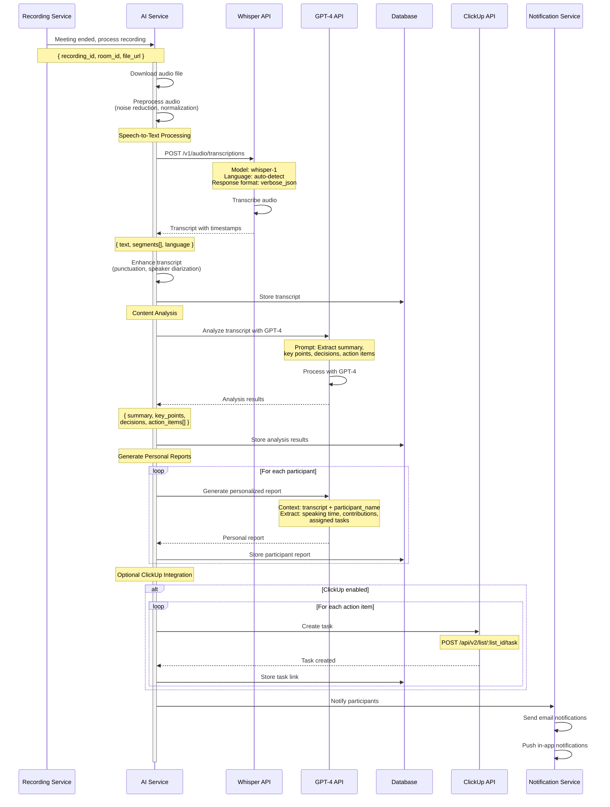
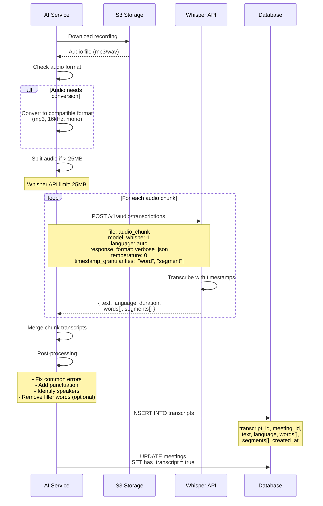
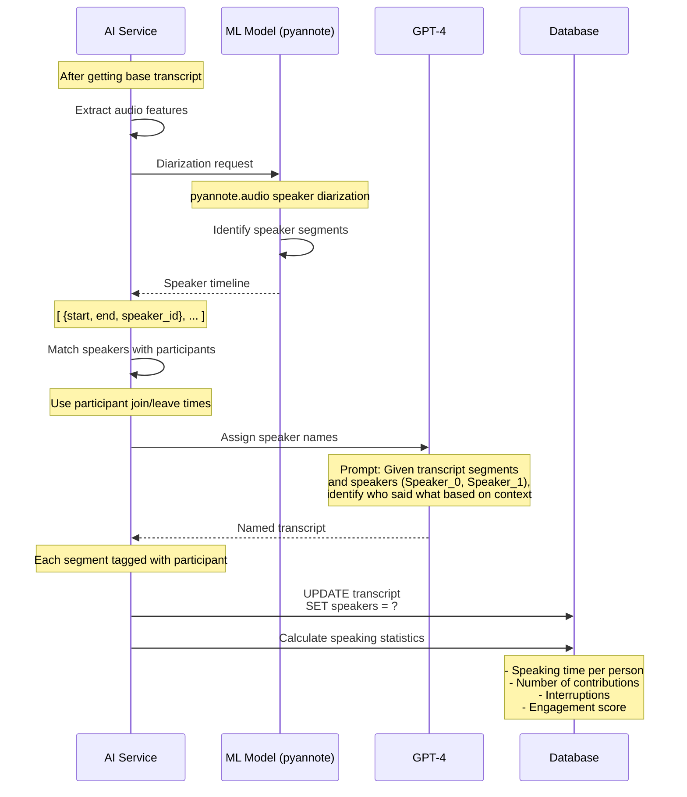
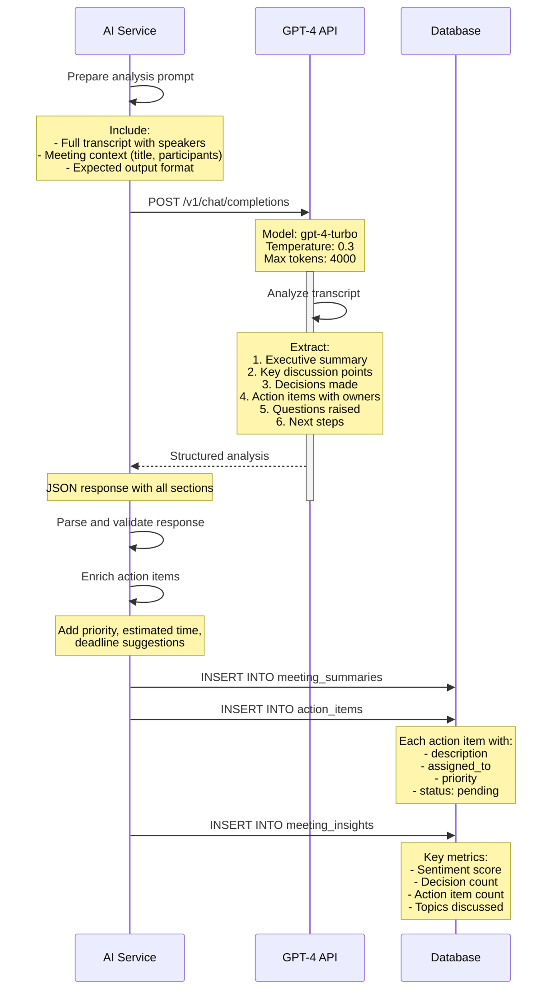
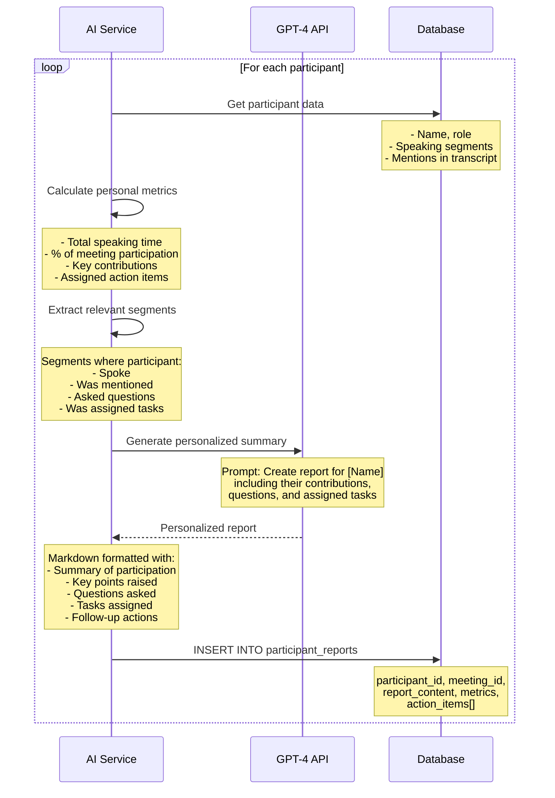
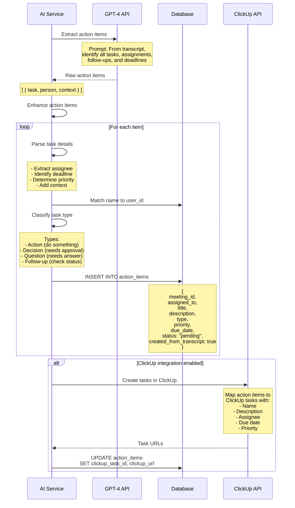
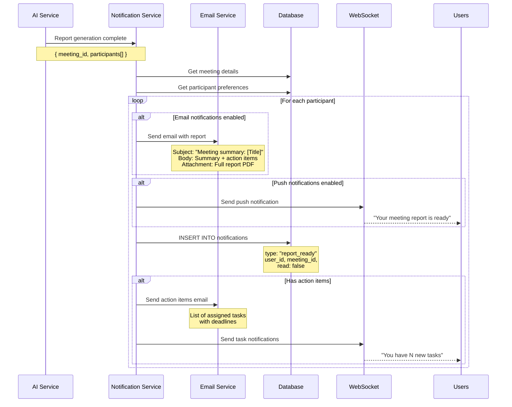

# AI Meeting Analysis Flow

## Overview

Hệ thống AI tự động xử lý ghi âm cuộc họp, chuyển đổi thành văn bản (transcript), phân tích nội dung và tạo báo cáo với action items cho từng người tham gia.

## AI Processing Pipeline

```
Recording → Audio Processing → STT (Whisper) → Transcript
                                                     ↓
                                        Text Analysis (GPT-4)
                                                     ↓
                            ┌────────────────────────┴────────────────────┐
                            ↓                                             ↓
                    Meeting Summary                              Action Items
                    Key Points                                   Assigned Tasks
                    Decisions Made                               Follow-ups
                            ↓                                             ↓
                    ┌───────────────────────────────────────────────────┐
                    │           Generate Personal Reports               │
                    └───────────────────────────────────────────────────┘
                                            ↓
                                    Notify Participants
```

## Complete AI Flow



## Speech-to-Text Process



## Speaker Diarization



## GPT-4 Analysis Process



## Personal Report Generation



## Action Items Extraction



## Notification Flow



## API Endpoints

```yaml
# Get Transcript
GET /api/meetings/:id/transcript
  Response:
    transcript_id: string
    text: string
    language: string
    segments: TranscriptSegment[]
    speakers: SpeakerMap

# Get Meeting Summary
GET /api/meetings/:id/summary
  Response:
    summary: string
    key_points: string[]
    decisions: string[]
    topics: string[]
    sentiment: number
    duration: number

# Get Action Items
GET /api/meetings/:id/action-items
  Query:
    assigned_to: user_id (optional)
    status: "pending" | "completed" (optional)
  Response:
    action_items: ActionItem[]

# Get Personal Report
GET /api/meetings/:id/report
  Response:
    report: PersonalReport
    metrics: ParticipationMetrics
    action_items: ActionItem[]

# Update Action Item
PATCH /api/action-items/:id
  Body:
    status: "pending" | "in_progress" | "completed"
    notes: string
  Response: ActionItem

# Regenerate Report
POST /api/meetings/:id/regenerate-report
  Body:
    include_speakers: boolean
    language: string
  Response:
    job_id: string
    status: "queued"

# Export Report
GET /api/meetings/:id/export
  Query:
    format: "pdf" | "docx" | "txt" | "json"
  Response: File download
```

## Database Schema

### transcripts table

```sql
CREATE TABLE transcripts (
    id UUID PRIMARY KEY DEFAULT gen_random_uuid(),
    meeting_id UUID NOT NULL REFERENCES meetings(id) ON DELETE CASCADE,
    text TEXT NOT NULL,
    language VARCHAR(10),
    segments JSONB, -- Array of {start, end, text, speaker}
    words JSONB, -- Word-level timestamps
    confidence_score FLOAT,
    processing_time INT, -- seconds
    created_at TIMESTAMP DEFAULT NOW()
);

CREATE INDEX idx_transcripts_meeting ON transcripts(meeting_id);
CREATE INDEX idx_transcripts_language ON transcripts(language);
```

### meeting_summaries table

```sql
CREATE TABLE meeting_summaries (
    id UUID PRIMARY KEY DEFAULT gen_random_uuid(),
    meeting_id UUID NOT NULL UNIQUE REFERENCES meetings(id) ON DELETE CASCADE,
    summary TEXT NOT NULL,
    key_points JSONB, -- Array of strings
    decisions JSONB, -- Array of strings
    topics JSONB, -- Array of strings
    sentiment_score FLOAT, -- -1 to 1
    metadata JSONB,
    created_at TIMESTAMP DEFAULT NOW()
);
```

### action_items table

```sql
CREATE TABLE action_items (
    id UUID PRIMARY KEY DEFAULT gen_random_uuid(),
    meeting_id UUID NOT NULL REFERENCES meetings(id) ON DELETE CASCADE,
    assigned_to UUID REFERENCES users(id),
    title VARCHAR(500) NOT NULL,
    description TEXT,
    type VARCHAR(50), -- 'action', 'decision', 'question', 'follow_up'
    priority VARCHAR(20) DEFAULT 'medium', -- 'low', 'medium', 'high', 'urgent'
    status VARCHAR(20) DEFAULT 'pending', -- 'pending', 'in_progress', 'completed', 'cancelled'
    due_date DATE,
    clickup_task_id VARCHAR(255),
    clickup_url TEXT,
    transcript_reference TEXT, -- Quote from transcript
    created_at TIMESTAMP DEFAULT NOW(),
    completed_at TIMESTAMP
);

CREATE INDEX idx_action_items_meeting ON action_items(meeting_id);
CREATE INDEX idx_action_items_assigned ON action_items(assigned_to);
CREATE INDEX idx_action_items_status ON action_items(status);
```

### participant_reports table

```sql
CREATE TABLE participant_reports (
    id UUID PRIMARY KEY DEFAULT gen_random_uuid(),
    meeting_id UUID NOT NULL REFERENCES meetings(id) ON DELETE CASCADE,
    participant_id UUID NOT NULL REFERENCES users(id),
    report_content TEXT NOT NULL,
    speaking_time INT, -- seconds
    speaking_percentage FLOAT,
    contribution_count INT,
    questions_asked INT,
    metrics JSONB,
    created_at TIMESTAMP DEFAULT NOW(),
    CONSTRAINT unique_meeting_participant UNIQUE (meeting_id, participant_id)
);

CREATE INDEX idx_reports_meeting ON participant_reports(meeting_id);
CREATE INDEX idx_reports_participant ON participant_reports(participant_id);
```

### meeting_insights table

```sql
CREATE TABLE meeting_insights (
    id UUID PRIMARY KEY DEFAULT gen_random_uuid(),
    meeting_id UUID NOT NULL UNIQUE REFERENCES meetings(id) ON DELETE CASCADE,
    total_speaking_time INT,
    participant_balance_score FLOAT, -- 0-1, how balanced speaking time was
    question_count INT,
    decision_count INT,
    action_item_count INT,
    dominant_speaker_id UUID REFERENCES users(id),
    topics JSONB,
    sentiment_breakdown JSONB,
    created_at TIMESTAMP DEFAULT NOW()
);
```

## GPT-4 Prompts

### Summary Generation Prompt

```
You are an AI meeting assistant. Analyze the following meeting transcript and provide a comprehensive summary.

Transcript:
{transcript_with_speakers}

Meeting Context:
- Title: {meeting_title}
- Date: {meeting_date}
- Participants: {participant_names}
- Duration: {duration}

Please provide:

1. **Executive Summary** (2-3 paragraphs)
   - Brief overview of the meeting
   - Main purpose and outcomes

2. **Key Discussion Points** (bullet points)
   - Important topics discussed
   - Main arguments or viewpoints

3. **Decisions Made**
   - Clear decisions that were reached
   - Who made the decision and context

4. **Action Items**
   - Specific tasks assigned
   - Person responsible
   - Deadline (if mentioned)
   - Context from discussion

5. **Open Questions**
   - Unresolved issues
   - Questions that need follow-up

6. **Next Steps**
   - What happens after this meeting
   - Future meetings or deadlines

Format the response as JSON with the following structure:
{
  "summary": "...",
  "key_points": ["...", "..."],
  "decisions": [{"decision": "...", "made_by": "...", "context": "..."}],
  "action_items": [{"task": "...", "assigned_to": "...", "deadline": "...", "context": "..."}],
  "open_questions": ["...", "..."],
  "next_steps": ["...", "..."]
}
```

### Personal Report Prompt

```
Create a personalized meeting report for {participant_name}.

Meeting Transcript:
{transcript}

Meeting Summary:
{meeting_summary}

Participant's Contributions:
{participant_segments}

Generate a report including:

1. **Your Participation Summary**
   - Speaking time and percentage
   - Key points you raised

2. **Your Contributions**
   - Important statements you made
   - Questions you asked
   - Ideas you suggested

3. **Action Items Assigned to You**
   - Task description
   - Priority
   - Suggested deadline
   - Context from discussion

4. **Relevant Discussions**
   - Topics where you were mentioned
   - Decisions affecting your work
   - Follow-ups needed

5. **Recommendations**
   - Suggested next actions
   - People to follow up with
   - Additional resources

Write in a professional, concise style. Use bullet points and clear sections.
Format as Markdown.
```

## Error Handling

### Processing Errors

```typescript
interface ProcessingError {
  code: string;
  message: string;
  recovery_action: string;
}

// Common errors
const errors = {
  AUDIO_FORMAT_INVALID: {
    code: "AUDIO_FORMAT_INVALID",
    message: "Audio file format not supported",
    recovery_action: "Convert audio to MP3 or WAV format"
  },
  AUDIO_TOO_LARGE: {
    code: "AUDIO_TOO_LARGE",
    message: "Audio file exceeds 25MB limit",
    recovery_action: "Split audio into smaller chunks"
  },
  TRANSCRIPTION_FAILED: {
    code: "TRANSCRIPTION_FAILED",
    message: "Failed to transcribe audio",
    recovery_action: "Retry with different settings or check audio quality"
  },
  GPT_RATE_LIMIT: {
    code: "GPT_RATE_LIMIT",
    message: "OpenAI API rate limit exceeded",
    recovery_action: "Queue for retry after cooldown period"
  },
  NO_SPEECH_DETECTED: {
    code: "NO_SPEECH_DETECTED",
    message: "No speech found in audio",
    recovery_action: "Check if recording captured audio properly"
  }
}
```

## Performance Optimization

### Processing Time Estimates

| Audio Duration | Whisper STT | GPT-4 Analysis | Total |
|----------------|-------------|----------------|-------|
| 10 minutes | ~30 seconds | ~20 seconds | ~1 min |
| 30 minutes | ~1.5 minutes | ~45 seconds | ~2.5 min |
| 60 minutes | ~3 minutes | ~1.5 minutes | ~5 min |

### Optimization Strategies

1. **Parallel Processing**
   - Process multiple audio chunks simultaneously
   - Generate participant reports in parallel

2. **Caching**
   - Cache GPT-4 responses for similar queries
   - Store intermediate results

3. **Async Queue**
   - Use message queue (RabbitMQ/Redis Queue)
   - Process jobs in background workers

4. **Progressive Results**
   - Stream transcript as it's generated
   - Show preliminary summary before full analysis

## Testing Scenarios

- [ ] Transcribe 10-minute meeting
- [ ] Transcribe 60-minute meeting
- [ ] Handle multiple speakers (2-5)
- [ ] Extract action items correctly
- [ ] Generate accurate summaries
- [ ] Identify speakers correctly
- [ ] Handle poor audio quality
- [ ] Process non-English meetings
- [ ] Handle interruptions and cross-talk
- [ ] Generate personalized reports
- [ ] Create ClickUp tasks
- [ ] Send notifications correctly
