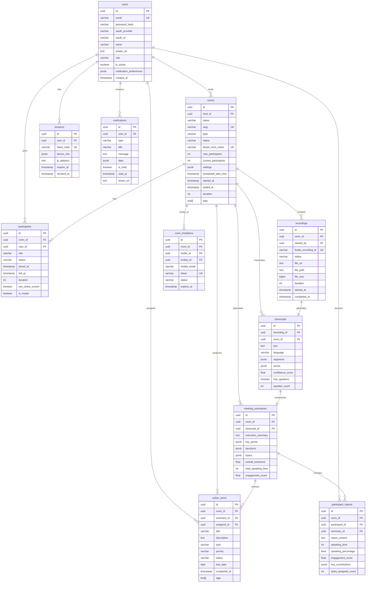

# Database Schema Overview

## Entity Relationship Diagram



## Table Summary

### Core Tables (6)
1. **users** - User accounts and profiles
2. **rooms** - Meeting rooms
3. **participants** - Room participation records
4. **recordings** - Meeting recordings
5. **transcripts** - Speech-to-text results
6. **meeting_summaries** - AI-generated summaries

### Supporting Tables (5)
7. **action_items** - Extracted tasks and action items
8. **participant_reports** - Individual participant reports
9. **sessions** - Authentication sessions
10. **room_invitations** - Meeting invitations
11. **notifications** - User notifications

## Key Relationships

### 1-to-Many
- User → Rooms (host)
- User → Participants
- User → Sessions
- User → Action Items (assigned)
- Room → Participants
- Room → Recordings
- Room → Action Items
- Room → Invitations

### 1-to-1
- Recording → Transcript
- Transcript → Meeting Summary
- Room → Meeting Summary

## Indexes Strategy

### Performance Indexes
- Foreign keys (all relationships)
- Frequently queried fields (status, type, email)
- Time-based queries (created_at, scheduled_start_time)
- Composite indexes for common queries

### Full-Text Search
- Transcripts text (GIN index)

### JSONB Indexes
- Tags arrays (GIN index)
- Segments in transcripts (GIN index)

## Data Flow

```
1. User Authentication
   └─> User creates/joins Room
       └─> Participant record created
           └─> Recording starts
               └─> Transcript generated
                   └─> Meeting Summary created
                       ├─> Action Items extracted
                       └─> Participant Reports generated
                           └─> Notifications sent
```

## Storage Estimates

### Small Scale (100 meetings/month)
- Users: ~1,000 records (~100KB)
- Rooms: ~100/month (~10MB/year)
- Recordings: ~100/month (~50GB/month)
- Transcripts: ~100/month (~5MB/month)
- **Total**: ~600GB/year

### Medium Scale (1,000 meetings/month)
- Users: ~10,000 records (~1MB)
- Rooms: ~1,000/month (~100MB/year)
- Recordings: ~1,000/month (~500GB/month)
- Transcripts: ~1,000/month (~50MB/month)
- **Total**: ~6TB/year

### Large Scale (10,000 meetings/month)
- Users: ~100,000 records (~10MB)
- Rooms: ~10,000/month (~1GB/year)
- Recordings: ~10,000/month (~5TB/month)
- Transcripts: ~10,000/month (~500MB/month)
- **Total**: ~60TB/year

## Maintenance

### Automated Cleanup (via cron or scheduled jobs)

```sql
-- Daily: Expire old invitations
SELECT cleanup_expired_invitations();

-- Daily: Clean old sessions
SELECT cleanup_expired_sessions();

-- Weekly: Clean read notifications (30+ days old)
SELECT cleanup_old_notifications(30);

-- Monthly: Archive old recordings (90+ days)
SELECT cleanup_old_recordings(90);
```

### Manual Maintenance

```sql
-- Vacuum tables
VACUUM ANALYZE users;
VACUUM ANALYZE rooms;
VACUUM ANALYZE recordings;

-- Reindex for performance
REINDEX TABLE transcripts;
REINDEX TABLE meeting_summaries;

-- Check table sizes
SELECT 
    tablename,
    pg_size_pretty(pg_total_relation_size(tablename::regclass)) as size
FROM pg_tables
WHERE schemaname = 'public'
ORDER BY pg_total_relation_size(tablename::regclass) DESC;
```

## Backup Strategy

### Continuous Backup
- WAL archiving enabled
- Point-in-time recovery (PITR) enabled
- 7-day retention

### Scheduled Backups
- **Daily**: Full backup at 2 AM UTC
- **Hourly**: Incremental backups
- **Retention**: 30 days

### Critical Data
- Users table: Hourly snapshots
- Rooms table: Hourly snapshots
- Action items: Daily snapshots

## Security

### Row-Level Security (RLS)
Consider implementing RLS for:
- Users can only see their own data
- Participants can only see their rooms
- Host has full control over their rooms

### Data Encryption
- Passwords: Bcrypt hashed
- OAuth tokens: Encrypted at rest
- Sensitive PII: Consider column-level encryption

### Audit Logging
Consider adding audit tables for:
- User actions
- Room access
- Data modifications
- Admin operations
